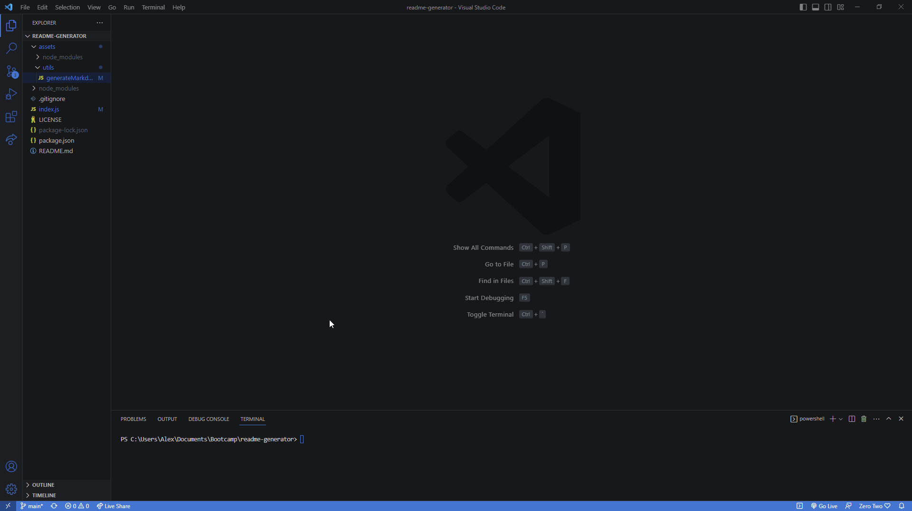

# README-generator

## Description

A faster way to create README files that uses a few prompts you need to answer

## Installation

In the command line enter

    -npm i
    
    -npm i inquirer@8.1.2

## Usage

After installing the necessary components you will be answering prompts to be inserted into the README file.

## Demonstration

## Technologies Used 

    - JavaScript
    - Inquirer 2.8.3
    - fs

## License

MIT
