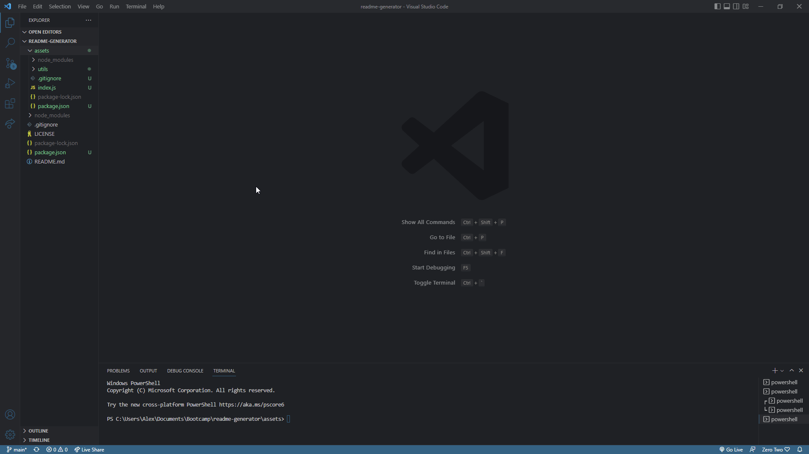

# README-generator

## Description

A faster way to create README files that uses a few prompts you need to answer


## Installation

In the command line enter
    -npm i
    -npm i inquirer@8.1.2

## Usage

Provide instructions and examples for use. Include screenshots as needed.

To add a screenshot, create an `assets/images` folder in your repository and upload your screenshot to it. Then, using the relative filepath, add it to your README using the following syntax:

    ```md
    
    ```


## License

MIT
